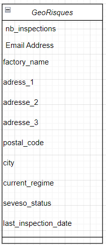
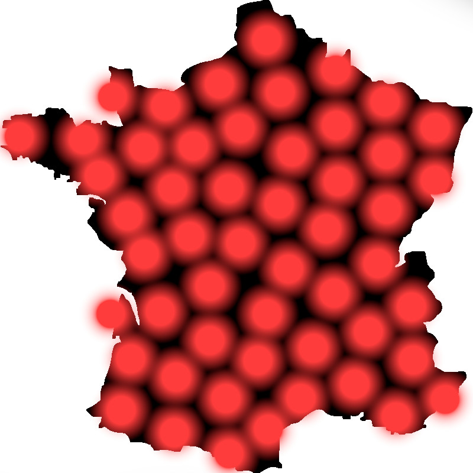
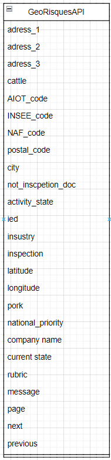
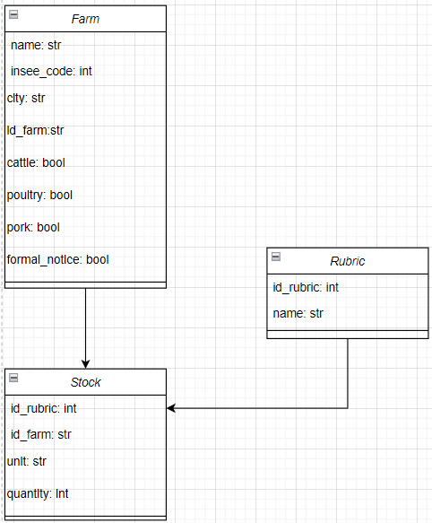

# Hyblab

Created: February 1, 2023 3:59 PM
Matière: Gestion informatique des connaissances
Reviewed: No

# Data Documentation

This document presents the data extraction process, the database and the way we are using the data

## Data extraction

We are using the database from the french national website [georisques.gouv.fr](http://georisques.gouv.fr).

This database has an API that allows us to get all the data about a factory farm. The API call requires a location pin (an address, an INSEE code or gps locations) and a radius (in km). That’s why we need to know where the farms are before doing the API calls to get the data we need.

That’s why we downloaded the database containing all the factory farms in France here : [https://www.georisques.gouv.fr/risques/installations/donnees?page=1](https://www.georisques.gouv.fr/risques/installations/donnees?page=1). We filtered by nomenclature (named “2101 - Elevage, transit, vente etc. de bovins”) as we only need the list of the factory farms producing cattle, poultry or pork. The data file contains around 10 000 factory farms and the data structure is a table looks like this :

This image is here just to give an idea of the way we fetch the factory farms data. In fact, we now have the list of all the farms with their postal code. We are cross-referencing the postal code with the INSEE code using the official postal code database produced by the french government.

We now have the list of the INSEE codes where at least a farm is located. We can now make as many API calls as the number of INSEE codes.

This image is just to give an idea of the way we fetch data, the size of the circles are not proportional.

The API returns a lot of data, the data structure looks like this :

As you can see, this data needs to be cleaned.

We now have all the data we need but it has to be extracted, cleaned and stocked in a well built database to make it easier to analyze.

We built a script that fetch the data we need and stock it in our final database :

